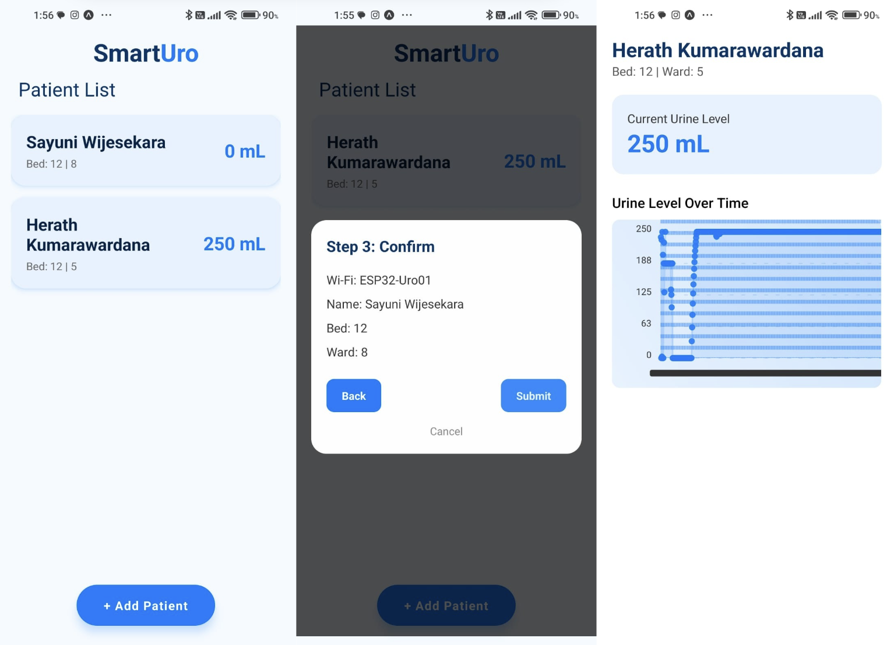

# SmartUro App

<p align="center">
  
</p>

SmartUro is a mobile companion app for our automatic urometer system. It displays real-time urine levels from the device, helps staff monitor patients efficiently, and is designed with simplicity and speed in mind.

## 🚀 Getting Started

1. Make sure you have [Expo Go](https://expo.dev/client) installed on your mobile device.
2. Clone this repo:
```bash
   git clone https://github.com/your-username/smarturo-app.git
   cd smarturo-app
   #Install dependencies
    npm install
    #start the app
    npx expo start
    ```