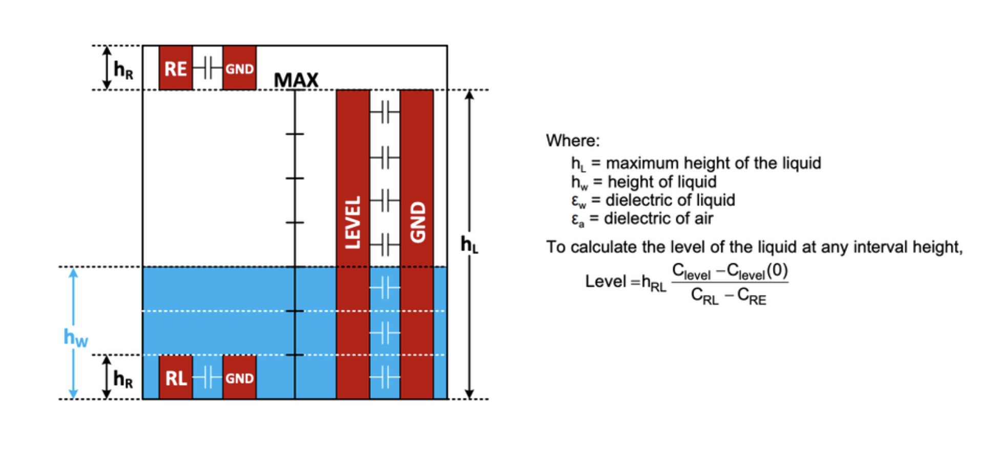
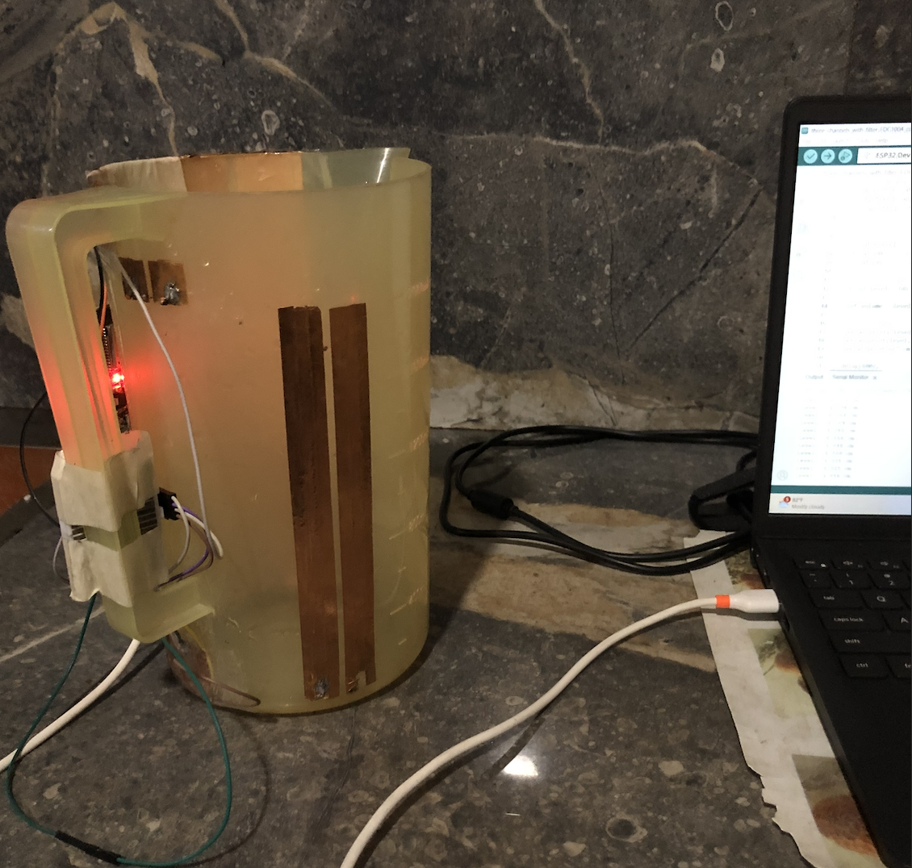

# SmartUro: Capacitive Urometer Monitoring System

SmartUro is a low-cost, non-invasive urine level monitoring system designed for hospitals and long-term care settings. This project introduces a novel approach using capacitive liquid-level sensing—eliminating moving parts and enabling real-time fluid tracking with wireless communication to a hospital app interface.

🚀 We were awarded 1st Runners-up at Brainstorm 2025 (University of Moratuwa)!

  

## 🔍 Motivation
In traditional urometers, manual monitoring is inefficient and error-prone, particularly in high-dependency care units. Our goal was to automate this process with a compact, cost-effective device that integrates seamlessly into hospital workflows.

## 💡 Features
- Capacitive liquid level measurement using FDC1004

- ESP32-based wireless data transmission

- Companion app built with React Native to monitor patient data

- Data storage and analytics using Firebase

- Accurate fluid sensing inside a fully shielded enclosure

- Compact, low-cost, and scalable design

## 🧪 Research and Experimentation
We explored multiple techniques before settling on the most suitable sensing method:

Based on the FDC1004 datasheet by Texas Instruments, we chose the conventional three-column capacitive height measurement method over the Out-of-Phase (OOP) technique.

This choice allowed us to shield the entire inner wall of the urometer enclosure with a single copper plate, which wouldn’t be compatible with the distributed electrode layout required for OOP.

Extensive experimentation was conducted using a beaker setup to validate the sensing accuracy and stability in real-world fluid scenarios.

  
  

## 📱 App Interface

A clean, modern Flutter-based mobile app allows nurses to monitor multiple patients in real-time, complete with patient names, timestamps, and sensor values.

## 🔬 Future plans include:

Exploring the OOP technique for enhanced linearity and accuracy

Miniaturizing the hardware

Pursuing intellectual property protection for our sensing architecture
